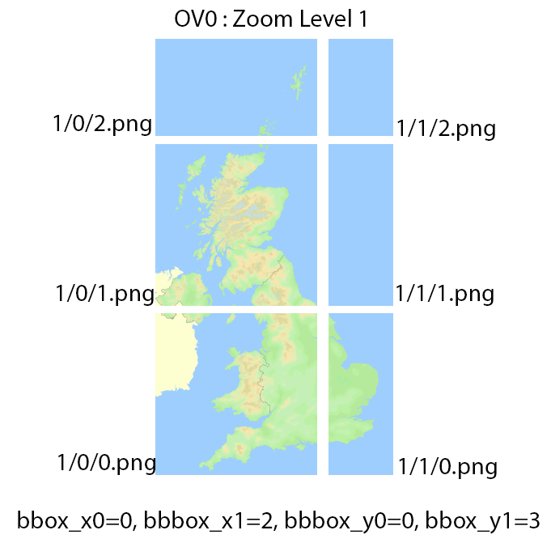

# ostiles
Various utility functions to work with Ordnance Survey raster map tiles

## Quick overview of how map tiles work
The Ordnance Survey (OS) use a modified form of the MBTiles specification, called OSTiles.
You can read all about it [here](https://github.com/OrdnanceSurvey/openspace-sdk-resources/blob/master/ostiles_spec.md).
 A main raster image map, tiff if it's from the OS, is sliced up into zoom levels, each with their own collection of
 columns and rows. The higher the zoom level, the more detail and therefore the greater the number of columns and rows
 in that zoom level.

## Extracting map tiles from an ostiles database
ostiles can extract the png map tiles from an Ordnance Survey OSTiles database. This file ends in .ostiles
and contains all the zoom levels and column/row image data for an offline map. You can try out ostiles using
the sample data in the OS iOS demo app:

[sample.ostiles](https://github.com/OrdnanceSurvey/ios-sdk-demo-tilesources/tree/master/Resources)

then run ostiles on it to extract the png map tiles:

<pre><code>
ostiles -mode extract \
        -ostiles /path/to/sample.ostiles \
        -tilesDir /path/to/tiles_from_db
</code></pre>

If we look at the OV0 product, this is the zoom level with least detail, corresponding to a 'furthest away' view of the
map. The tiles are arranged on disk as per the MBTiles specification and look like this:

the above shows also the minimum/maximum columns/rows for the zoom level. We need these when we're creating an OSTiles
database from map tiles on disk.
